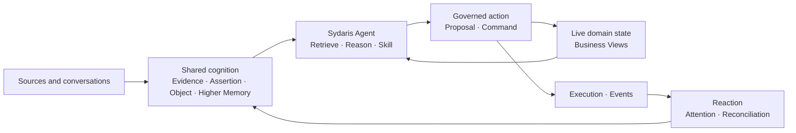

# Sydaris

> Organizational continuity for agentic work.

Sydaris is an open-source runtime for sustained collaboration between people and AI. It turns organizational sources into traceable shared cognition, keeps live work in explicit business views, and lets agents participate through governed actions whose outcomes shape future context.

Initial public release: `v0.1.0-alpha.1`

## One continuous workspace

Organizations accumulate documents, decisions, operating experience, responsibilities, and unfinished work across members and operating cycles. Sydaris connects them through one continuous loop:



| Stage | Sydaris capability |
| --- | --- |
| Remember | Sources and conversations become traceable organizational knowledge |
| Orient | Business Views represent the organization’s current operational state |
| Act | Skills, Proposals, and Commands turn intent into governed operations |
| Continue | Executions, Events, and Reactions shape the context for future work |

## Design

### Traceable shared cognition

The Shared Brain connects four forms of organizational cognition:

- **Evidence** preserves addressable content from documents and member statements.
- **Assertions** turn supported information into reusable claims.
- **Objects** maintain stable identities across sources and operating contexts.
- **Higher Memory** gives agents compact entry points into relevant knowledge, sources, and state.

Knowledge remains connected to the evidence and source material that supports it. Source recompilation publishes an atomic update to the organization’s current shared cognition.

### Explicit domain state

Business Views represent current work through typed Cards, Dimensions, Slots, and Related Objects. Each View defines its own domain schema, queries, commands, invariants, events, and AI write policy.

Agents can bring historical knowledge and current state into the same task while each retains a clear source of authority.

### Governed agent participation

Skills organize specialized agent workflows and declare the Views, Commands, and external capabilities available to them. Formal state changes pass through Domain Commands, with runtime validation for schemas, permissions, invariants, concurrency, execution records, and events.

Each View selects an agent write policy:

```text
approval_required → Proposal → Member approval → Command
auto_execute      → Command
```

### Continuity after action

A successful Command produces an Execution, a structured change set, and Domain Events. View Change Reactions evaluate the resulting state, surface relevant attention, and reconcile Object or View Higher Memory for the next task.

Each completed action becomes part of the organization’s continuing work.

## Architecture

| Runtime | Responsibility |
| --- | --- |
| Library and Cognitive Runtime | Source processing, Evidence, Assertions, Objects, Higher Memory, retrieval, grounding, and citations |
| Business View Runtime | Card Graph state, queries, Commands, Invariants, Proposals, Executions, Events, and Reactions |
| Agent Runtime | Conversation context, knowledge exploration, View access, Skills, Tools, action planning, and observation |
| Extension Runtime | Plugin registry, public contracts, capability resolution, and provider execution |
| Shell | Web application, API, authentication, and composition of installed Plugins |

Plugins extend Sydaris with four complementary capabilities:

| Extension | Capability |
| --- | --- |
| `ViewModule` | Domain state, queries, Commands, Invariants, and Events |
| `PresentationExtension` | A specialized human workspace for a View |
| `SkillExtension` | A focused agent workflow with declared data and action access |
| `ToolProviderExtension` | An implementation of an external capability contract |

## Reference deployments

Reference deployments show how Sydaris can be composed for a real organizational environment.

| Distribution | Maintainer | Environment | Components |
| --- | --- | --- | --- |
| [Sydaris for USTCTTA](https://github.com/USTC-Student-TableTennisAssociation/association-management) | USTC Student Table Tennis Association | Student organization continuity, activity operations, and competition records | Society Information · Activity Operations · Competition Records |

## Quick start

### Requirements

- Node.js 20+
- pnpm
- PostgreSQL, or the Prisma local development database included in the repository
- Python 3.11 or 3.12 with [`uv`](https://docs.astral.sh/uv/)
- An OpenAI-compatible chat model

Sydaris uses BGE-M3 for full Shared Brain retrieval. MinerU and a vision model support deep processing for corresponding documents and images.

### Install

```bash
pnpm install
cp .env.example .env
```

Configure the chat model in `.env`:

```env
AI_API_KEY=
AI_API_BASE_URL=https://api.openai.com/v1
AI_MODEL=
```

The example environment file also contains database, embedding, vision, Library, Shared Brain, and diagnostics settings.

### Start the database

```bash
pnpm prisma:dev
pnpm prisma:deploy
pnpm prisma:generate
```

For an existing PostgreSQL deployment, configure `DATABASE_URL` and `SHADOW_DATABASE_URL`.

### Start Shared Brain retrieval

```bash
pnpm memory:serve-embeddings
```

The first run can download BGE-M3. `COLD_START_EMBEDDING_MODEL` can point to a local model directory.

### Start Sydaris

```bash
pnpm dev
```

Open [http://localhost:3000/setup](http://localhost:3000/setup) to create the first administrator. Add source material through Library, publish the initial shared cognition, and begin working with Sydaris.

Install a domain Plugin to add Business Views, specialized workflows, and external capabilities.

## Plugin development

Sydaris Plugins use the public `@sydaris/plugin-sdk` contracts and are composed with the host at build time.

```bash
pnpm sydaris:plugin install ./my-plugin.tgz
pnpm sydaris:plugin list
pnpm sydaris:plugin generate --check
```

Plugin packages declare their entry points, contributed extensions, Sydaris compatibility range, and Plugin dependencies through `sydaris.plugin.json`.

## Repository structure

```text
src/
├── contracts/        Public runtime contracts
├── runtime/          Extension host and Tool runtime
├── view-runtime/     Domain state and execution runtime
├── agent-runtime/    Agent-facing View, Skill, and Tool runtime
├── ai/               Chat orchestration and grounding
├── memory/           Shared Brain and Higher Memory
├── evidence/         Evidence-layer semantics
├── library/          Sources and knowledge compilation
├── shell/            Composition root
├── app/              Web application and API routes
└── auth/             Identity and sessions

packages/
└── plugin-sdk/       Public Plugin SDK

services/
├── cold-start/       Cognitive compilation and BGE-M3 service
└── mineru-parser/    Document parsing service

prisma/               Database schema and migration baseline
```

## Project status

Sydaris `v0.1.0-alpha.1` connects Library, Shared Brain, Business Views, Agent Runtime, Skills, Proposals, Commands, Executions, and Reactions through an end-to-end working path. Runtime and Plugin contracts will continue to evolve through the alpha releases.

Verification covers cognition publication, evidence citations, grounding, View queries, Commands, Proposals, invariants, state-version concurrency, Plugin boundaries, and background recovery.

```bash
pnpm lint
pnpm test
pnpm exec tsc --noEmit
pnpm prisma validate
pnpm build
```

## Contributing

See [`CONTRIBUTING.md`](CONTRIBUTING.md) for architecture boundaries, development workflow, and verification requirements.

## License

Sydaris is licensed under the [Apache License 2.0](LICENSE).
